## 实验要求

- 安装并使用cuckoo，任意找一个程序，在cuckoo中trace获取软件行为的基本数据。

## 实验原理

### Cuckoo Sandbox

> Cuckoo Sandbox是一款用于自动分析可疑文件的开源软件。为此，它利用自定义组件，监控恶意进程在隔离环境中运行时的行为。
> 
> ---
> 用处:
> -   Generic Windows executables
> -   DLL files
> -   PDF documents
> -   Microsoft Office documents
> -   URLs and HTML files
> -   PHP scripts
> -   CPL files
> -   Visual Basic (VB) scripts
> -   ZIP files
> -   Java JAR
> -   Python files
> -   *Almost anything else*

#### 架构

> Cuckoo基础架构的主要组成部分是一台Host机器（管理软件）和一些Guest机器（用于分析的虚拟机或物理机）。
>  
> Host运行着管理整个分析过程的沙箱核心组件，而Guest机则是恶意软件样本实际安全执行和分析的隔离环境。

### Sandboxing

> 在计算机安全中，沙箱是一种分离运行程序的安全机制。它通常用于执行未经测试的代码，或来自未经验证的第三方、供应商、不受信任的用户和不受信任的网站的不受信任的程序
> 
> **恶意软件沙箱是动态分析方法的实际应用：不是静态分析二进制文件，而是实时执行和监控**。它是一种有价值的技术，可以获得恶意软件的额外细节，如其网络行为。因此，在检查一个恶意软件时，同时进行静态和动态分析是一个很好的做法，以便更深入地了解它
> 
> ---
> 你的目标应该是既要创建一个能够处理你所需要的所有要求的系统，同时也要尽量使其符合实际情况。
> 
> 比如你可以考虑在正常使用的情况下故意留下一些痕迹，比如浏览历史、cookies、文档、图片等。如果一个恶意软件是为了操作、操纵或窃取这类文件，你就能注意到它。

### 实验环境

- 两台主机配置在一个内网（inet-1）下

| 主机               | 地址                 |
| ------------------ | -------------------- |
| host(ubuntu-18.04) | 192.168.50.129       |
| guest(win-7)       | 192.168.50.102(dhcp) |

### 实验内容

#### 安装

##### Host：Ubuntu 18.04

vbox网络

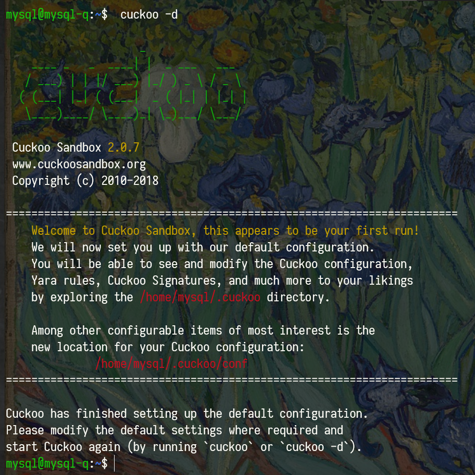

- 在inet上搭建dhcp-server，让guest拿ip地址
  - isc-dhcp-server

##### Guest：Win-xp Pro

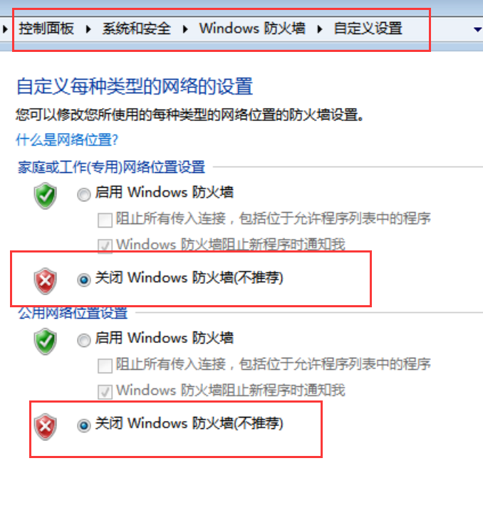

做到相互ping通

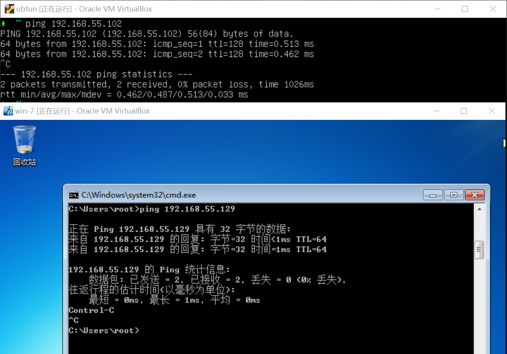

####  配置

- `.cuckoo/conf/`下

```sh
# cuckoo.conf
[resultserver]
ip = 192.168.55.129 

# auxillary.conf
[sniffer]
enabled = yes
tcpdump = /usr/sbin/tcpdump # which tcpdump

# reporting.conf
[mongodb] 
enabled = yes

[virtualbox]
mode = gui # gui是有界面，headless是无界面，调试的时候可以选择
path = /usr/bin/vboxmanage
interface = vboxnet0
machines = cuckoo1 # 你的虚拟机名称 即启动win7 输入密码对应的用户名
controlports = 5000-5050

# virtualbox.conf
[host]  
label = host
platform = windows
ip = 192.168.50.102 
snapshot = snapshot1
```

guest
- python2.7
  - PIL
  - agent.py

#### 启动

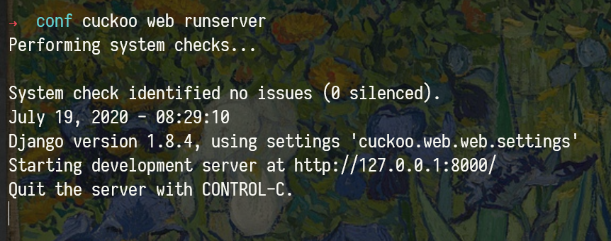

### 病毒样例分析

方便起见，在[vxvault](http://vxvault.net/ViriList.php)上找一个病毒样例，并在[cuckoo.cert.ee](https://cuckoo.cert.ee)中提交分析

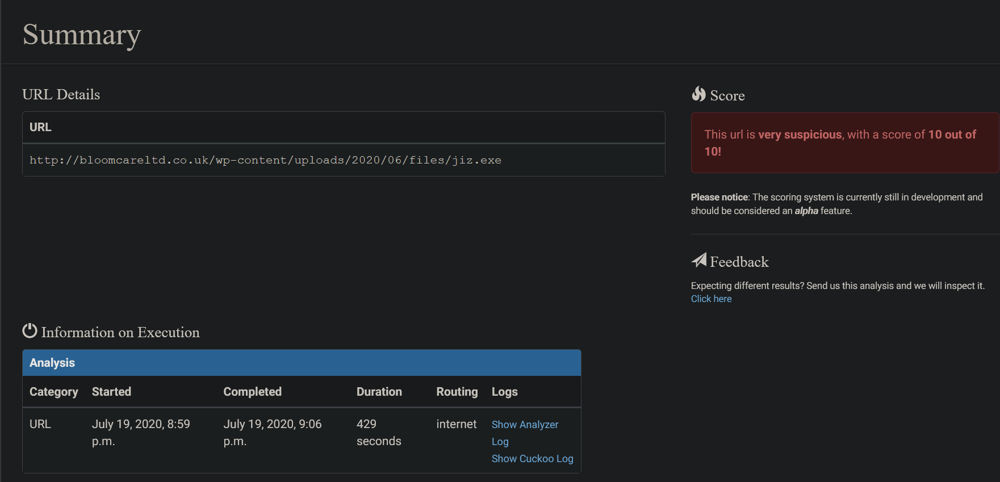

特征

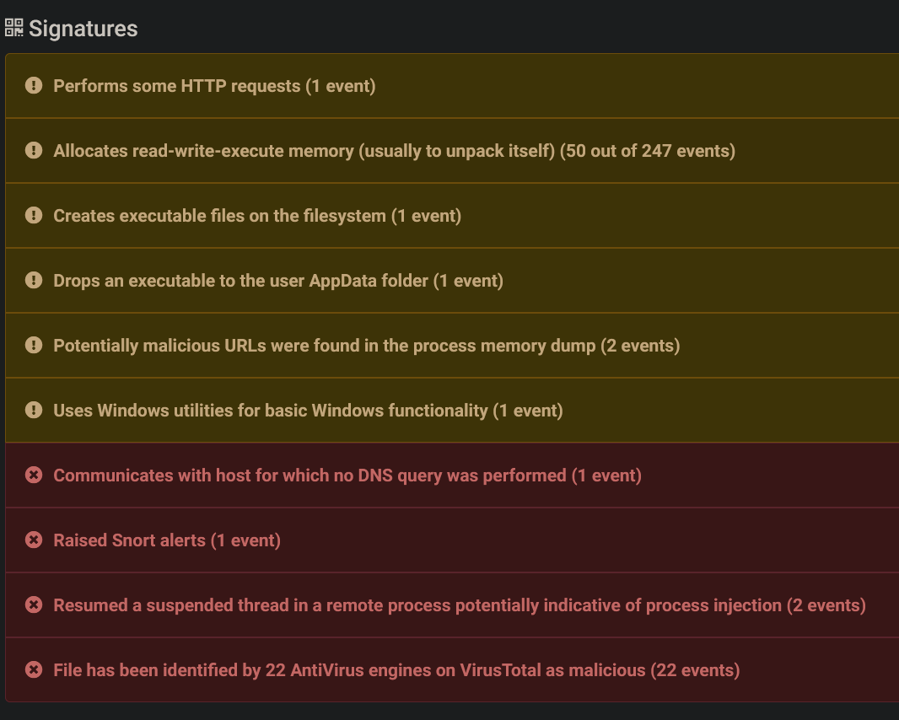

执行树

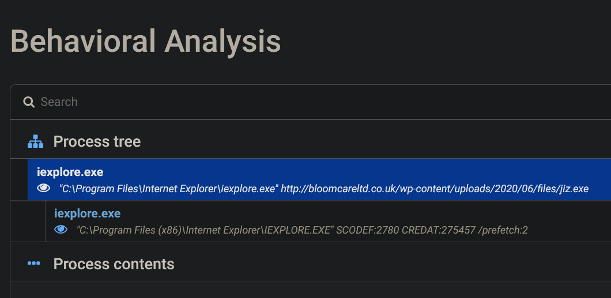

- 可以看出是针对IE浏览器进行攻击
  - Reads Internet Cache Settings

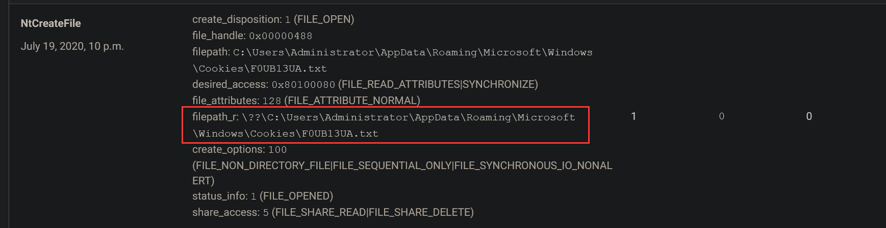

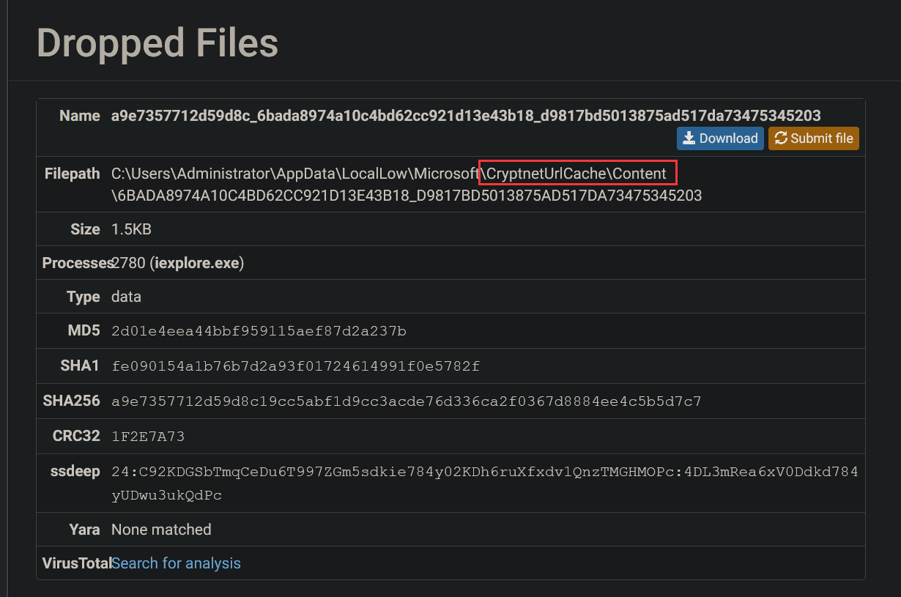

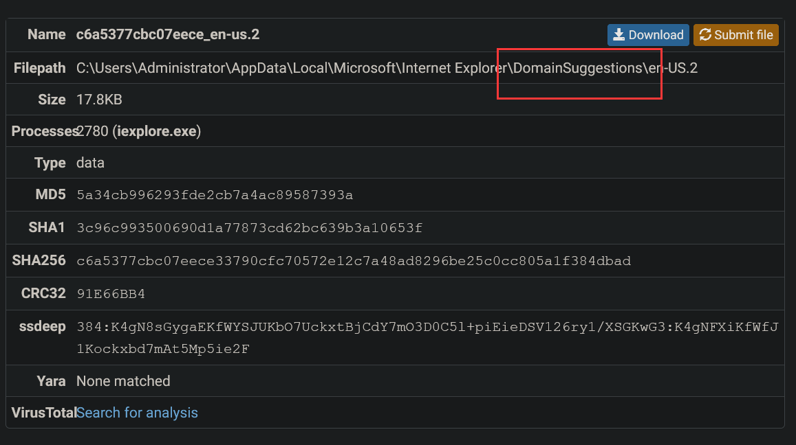

引用[Any Run](https://any.run/report/a44a479e9635f6dd36c58f37e2bb364e9b7698a2b089624ae995d2256ee63ae7/60772f4c-813b-47e7-8c22-f44eb04a5b3c#generalInfo)的结果

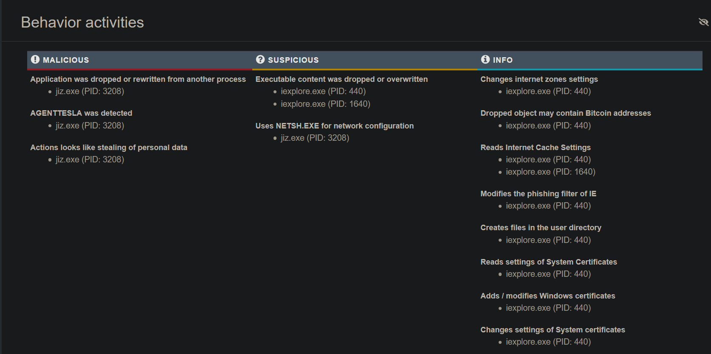

### 常见问题

- [How to Install a Desktop (GUI) on an Ubuntu Server](https://phoenixnap.com/kb/how-to-install-a-gui-on-ubuntu)


- [How To Set Permanent DNS Nameservers in Ubuntu and Debian](https://www.tecmint.com/set-permanent-dns-nameservers-in-ubuntu-debian/)

## 参考

- [Cuckoo Sandbox Book — Cuckoo Sandbox v2.0.7 Book](https://cuckoo.readthedocs.io/en/latest/)